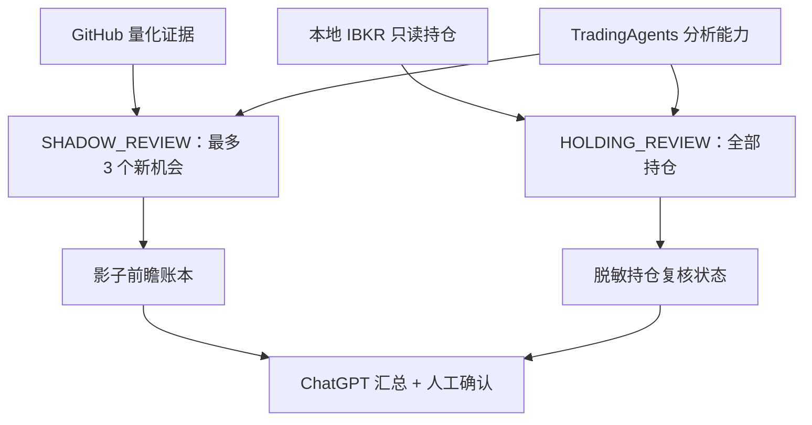

# 独立 HOLDING_REVIEW 与 TradingAgents 组合契约

`HOLDING_REVIEW` 只回答“现有真实持仓是否出现需要人工复核的风险”，不回答“今天可以买什么”。它与量化买入链、影子证据链并行，不能改写 `decision_packet.json` 的 `final_action`，也不计入前瞻样本或人工试运行放行门槛。



## 两条复核支路必须分离

| 项目 | `SHADOW_REVIEW` | `HOLDING_REVIEW` |
|---|---|---|
| 对象 | 当日新机会 | 当前私有 IBKR 真实持仓 |
| 选取 | 固定规则排名，最多 3 个 | 全部、去重、排序、无排名、无上限 |
| 动作 | `BUY_REVIEW` / `WAIT` / `REJECT` / `NO_TRADE` | `HOLD` / `REDUCE_REVIEW` / `EXIT_REVIEW` / `NO_ACTION` |
| 是否可生成买入候选 | 否，仅反事实研究 | 否 |
| 是否改变 `NO_TRADE` | 否 | 否 |
| 是否影响买入门槛 | 只按既有成熟样本规则累计 | 否，完全不进入放行计算 |
| 是否自动下单 | 否 | 否 |

TradingAgents 可以共享行情、技术、新闻和基本面分析组件，但适配器必须分别读取两套请求、分别生成两套响应。禁止把持仓复核结果转换成执行候选，也禁止用“已经持有”绕过买入标准。

## 私有请求与响应

本地请求：`private/ibkr/holding_review_request.json`

本地响应：`private/ibkr/holding_review_response.json`

请求和响应分别由以下 Schema 约束：

- `schemas/holding_review_request.schema.json`
- `schemas/holding_review_response.schema.json`

每只持仓都必须完成五项检查：行情、技术风险、近期新闻/事件、财报与基本面、真实账户风险。任一检查为 `FAIL` 或 `UNAVAILABLE` 时，该持仓只能返回 `NO_ACTION`。`REDUCE_REVIEW` 或 `EXIT_REVIEW` 还必须包含本次请求窗口内的盘中行情证据；只有旧 EOD 数据时不能给出这两个动作。完整覆盖要求按请求中冻结的符号顺序逐只返回，缺失、重复或重排都会拒绝。

TradingAgents 适配器只需把 `reviewer.system` 设为 `TRADINGAGENTS`，并严格输出响应 Schema。它不是订单代理；响应中的 `automatic_order_allowed` 固定为 `false`、`order_payload` 固定为 `null`，所有动作仍需用户在 IBKR 手工确认。

## 本地运行

一次准备正常实时复核和全持仓复核：

```text
python -m scripts.run_v6_live_cycle prepare
```

也可在新鲜私有上下文已经存在时单独生成持仓复核请求：

```text
python -m scripts.holding_review_contract build-request
```

适配器写入私有响应后，先验证再生成公开脱敏状态：

```text
python -m scripts.holding_review_contract validate-response
python -m scripts.run_v6_live_cycle finalize-holdings
```

公开文件 `docs/holding_review_status.json` 只包含覆盖数量、动作数量、审查者指纹和边界确认，不包含持仓符号、账户号、股数、成本、余额或逐股推理。没有本地 IBKR 上下文时公开状态为 `PRIVATE_IBKR_CONTEXT_REQUIRED`，不会伪造“没有持仓”。

## 固定安全边界

- `quant_final_action_unchanged=true`
- `buy_standard_modified=false`
- `can_create_buy_candidate=false`
- `affects_shadow_evidence_gate=false`
- `automatic_order_allowed=false`
- `human_confirmation_required=true`

公开状态会进入 `action_board.json` 和 `chatgpt_snapshot.json` 供汇总展示，但不会作为 `final_gate`、模型晋升或人工试运行的输入。汇总层还会把复核日期与当前量化市场日期比较；只有同一市场日且状态为完整复核或确实无持仓时，`usable_for_current_holding_decision` 才为 `true`，旧复核不会被当作今天的持仓判断。
