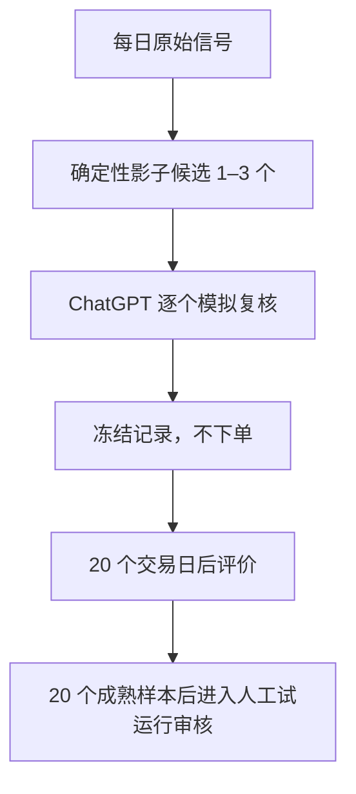

# NO_TRADE 下的影子证据收集

这条链路只改变“如何收集证据”，不降低买入标准，也不改变最终执行结论。`decision_packet.json` 把候选明确分为：

- `EXECUTION_CANDIDATE`：必须通过原有样本、收益、alpha、MAE、数据新鲜度和风险门槛，才允许进入人工实时下单审核。
- `SHADOW_CANDIDATE`：从当天新鲜、规则有效的活跃原始信号中确定性选择前 1–3 个，仅用于反事实研究。

每个影子候选固定包含：

```text
counterfactual_only = true
execution_eligible = false
automatic_order_allowed = false
```

因此 ChatGPT 对影子候选给出 `BUY_REVIEW`，也不会把 GitHub 的 `NO_TRADE` 升级成真实买入许可。



## 前瞻起点与禁止回填

政策冻结在 `config/shadow_evidence_policy.json`。最早可计数市场日为 `2026-07-15`；如果代码在更晚日期合并，第一批样本自然从合并后能够完成当日复核的最新市场日开始。程序不会扫描旧报告补样本，并要求请求和响应都绑定“当时最新的已完成市场日”。旧日期请求会显式失败。

## 每日复核

当 `candidates.shadow.collection_status` 为 `READY_FOR_SAME_DAY_SHADOW_REVIEW` 时：

```text
python -m scripts.shadow_review_contract build-request
```

ChatGPT/Codex 按 `schemas/shadow_review_response.schema.json` 对每个候选逐一给出 `BUY_REVIEW`、`WAIT`、`REJECT` 或 `NO_TRADE`，并完成四项检查。一个候选缺失会使整批失败，避免只保留想要的案例。响应完成后在本地记录：

```text
python -m scripts.build_shadow_review_forward_ledger record-review \
  --request private/shadow/shadow_review_request.json \
  --response private/shadow/shadow_review_response.json
```

公开输出只含脱敏的标签、候选、规则、冻结基准、检查计数和不可变哈希，不含账户数据，也不含订单。

## 20 个交易日后的评价

每日公开工作流运行：

```text
python -m scripts.build_shadow_review_forward_ledger update-outcomes
```

它按下一交易日收盘假设入场，并在 20 个交易栏后记录：

- 假设毛收益与冻结成本后的净收益；
- 收盘路径最大不利波动；
- 同一入场/退出日期相对 SPY、QQQ 或候选冻结基准的表现；
- `BUY_REVIEW` 与 `WAIT/REJECT/NO_TRADE` 的分组结果和均值差。

所有候选都必须到期入账。每日窗口可能重叠，因此状态文件会明确提示样本相关性，不能把 20 个样本误称为 20 个独立实验。

## 人工试运行闸门

`v6_release_status.json` 的人工试运行前置证据是：

- 公开前瞻主周期成熟结果至少 20 个；
- 影子复核成熟结果至少 20 个；
- 数据、模型、影子账本和 IBKR→ChatGPT 只读契约正常。

真实交易数量不参与放行，只用于开始人工试运行后的实盘复盘。

## ETF 穿透

`build_etf_lookthrough.py` 只接受 Invesco QQQ 和 VanEck SMH 官方域名数据，校验持仓日期、成分数量和权重合计后才计算重复暴露。缺失、解析不完整或超过两工作日时输出 `UNAVAILABLE`。ETF 穿透不会阻止影子样本积累，也不会创建或升级买入候选；真实账户穿透仍只能在私有本地上下文中完成。
